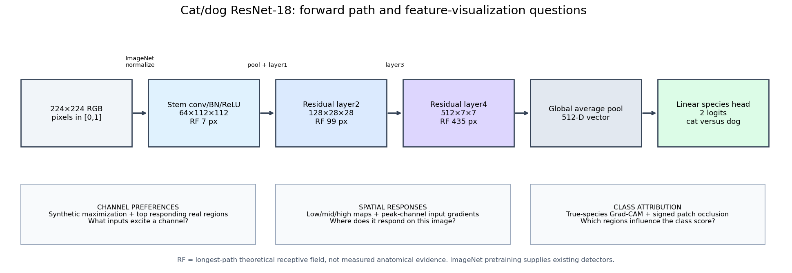
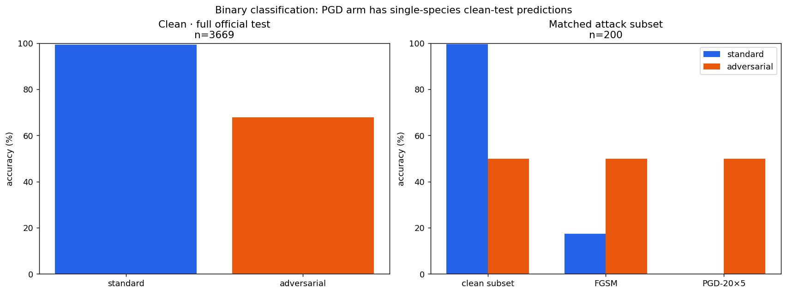
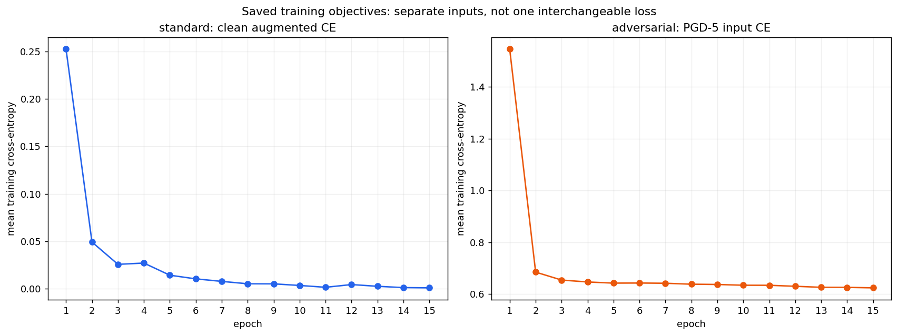
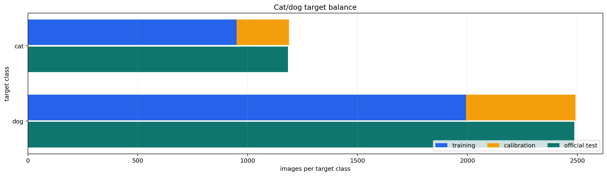
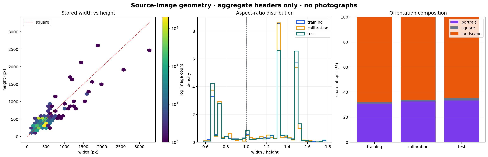
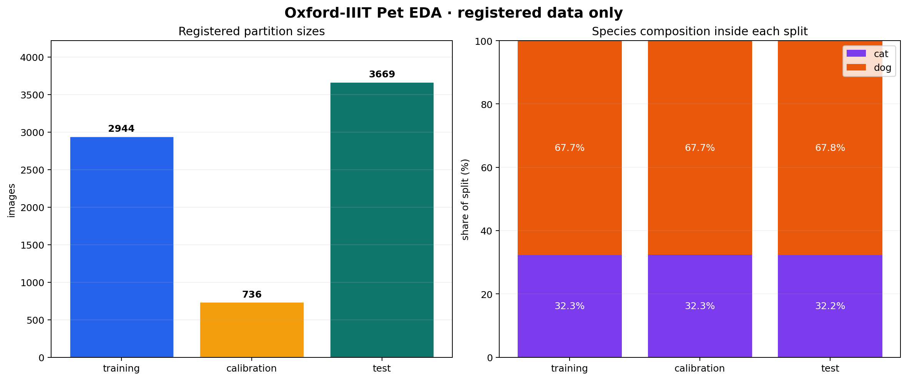
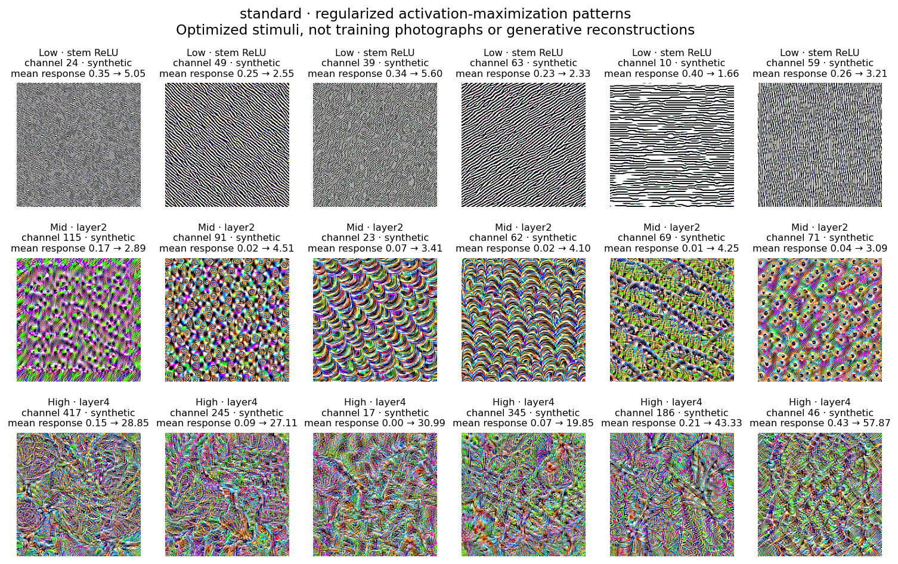
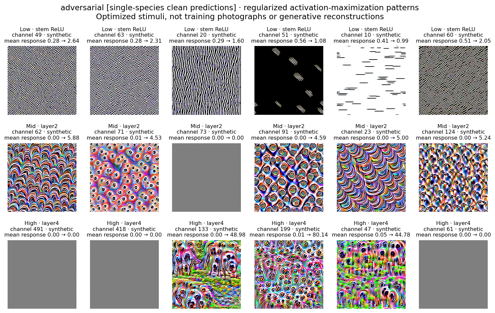

# Results: cat/dog CNN feature learning and localization

Matched standard and adversarial ResNet-18 arms completed 15 epochs for cat=0
versus dog=1. Both begin from identical ImageNet tensors and a new binary classifier.
This revised study is descriptive feature/localization analysis, not the old breed
geometry/retention experiment.

> **Classifier failure — adversarial.** WARNING: this arm predicts only dog on all 3669 clean test images (macro accuracy 50%). Nominal attack survival must not be presented as useful robust cat/dog recognition. This is a classifier prediction failure, not proof that all hidden features are constant. Cat recall is **0.00%**, dog recall is **100.00%**. The nominal clean accuracy equals the **67.76% constant-dog baseline** on this species-imbalanced test partition. Balanced attack-set survival does not establish useful binary recognition.

## Classification and finite attacks

The attack table uses the same
200-image
species-balanced test subset for clean/FGSM/PGD accuracy. Full clean/corruption accuracy
below uses 3669 official test images. These
denominators must not be interchanged.

| Arm | Clean subset | FGSM robust | PGD-20×5 robust | PGD success among clean-correct |
|---|---:|---:|---:|---:|
| standard | 99.50% | 17.50% | 0.00% | 100.00% |
| adversarial | 50.00% | 50.00% | 50.00% | 0.00% |

## Selected early/middle/late channels

| Arm | Layer | Spatial grid | Receptive field (px) | Selected channels | Mean response change vs initialization |
|---|---|---:|---:|---|---:|
| standard | `network.layer2` | 28×28 | 99 | 115, 91, 23, 62, 69, 71 | 0.0288 |
| standard | `network.layer4` | 7×7 | 435 | 417, 245, 17, 345, 186, 46 | 0.3294 |
| standard | `network.relu` | 112×112 | 7 | 24, 49, 39, 63, 10, 59 | 0.0249 |
| adversarial | `network.layer2` | 28×28 | 99 | 62, 71, 73, 91, 23, 124 | -0.0795 |
| adversarial | `network.layer4` | 7×7 | 435 | 491, 418, 133, 199, 47, 61 | -0.2562 |
| adversarial | `network.relu` | 112×112 | 7 | 49, 63, 20, 51, 10, 60 | 0.0209 |

**Figure caption.** Measured-layer architecture and distinct probe questions: synthetic channel preferences, spatial responses/local sensitivity, and class attribution. Intermediate layer1/layer3 are included in the forward path, although not selected for image grids.

**Figure caption.** Saved classification evidence: clean official-test accuracy is separate from matched-subset clean/FGSM/PGD accuracy. Finite attacks do not certify robustness, and these values do not validate a named feature. WARNING: this arm predicts only dog on all 3669 clean test images (macro accuracy 50%). Nominal attack survival must not be presented as useful robust cat/dog recognition. This is a classifier prediction failure, not proof that all hidden features are constant.

**Figure caption.** Per-epoch saved objectives shown separately: standard CE uses clean augmented inputs; adversarial CE uses PGD training inputs. Lower loss across arms is not a matched-objective quality comparison.

**Figure caption.** Dataset EDA: class balance.

**Figure caption.** Dataset EDA: image geometry.

**Figure caption.** Dataset EDA: split and species.

**Figure caption.** Layer-wise optimized channel preferences. Every tile is independently optimized from private seeded noise; visual appearance is not evidence of a named detector.

**Figure caption.** Raw channel response means on balanced calibration samples; activation scales differ by layer/arm, and brightness in overlays is not an arm comparison.

**Figure caption.** Relative change on identical calibration images from ImageNet initialization. This demonstrates change, not that all visible patterns were newly learned here.

**Figure caption.** Actual first-layer weights, initialized weights, and their differences. Deeper channel filters have many input channels and are instead probed with optimization and real examples.

**Figure caption.** Average single-tile occlusion effect for Grad-CAM-ranked versus random equal-area tiles. Not an additive whole-mask effect; four anchors do not support a population claim.

**Figure caption.** Layer-wise optimized channel preferences. Every tile is independently optimized from private seeded noise; visual appearance is not evidence of a named detector. WARNING: this arm predicts only dog on all 3669 clean test images (macro accuracy 50%). Nominal attack survival must not be presented as useful robust cat/dog recognition. This is a classifier prediction failure, not proof that all hidden features are constant.

**Unsuccessful single-start activation maximization — adversarial:** network.layer2 channel(s) 73; network.layer4 channel(s) 491, 418, 61. Their recorded unregularized response was exactly 0 → 0; gray tiles are unsuccessful optimized stimuli from this one start, **not evidence of dead channels or that the model learned nothing**. The same channels have positive measured responses on real clean calibration inputs. Recorded channel choices and protocol are preserved: no retry, reselection, or retraining was used to replace these tiles. Per-channel responses/statuses are included in the aggregate JSON.

**Figure caption.** Raw channel response means on balanced calibration samples; activation scales differ by layer/arm, and brightness in overlays is not an arm comparison. WARNING: this arm predicts only dog on all 3669 clean test images (macro accuracy 50%). Nominal attack survival must not be presented as useful robust cat/dog recognition. This is a classifier prediction failure, not proof that all hidden features are constant.

**Figure caption.** Relative change on identical calibration images from ImageNet initialization. This demonstrates change, not that all visible patterns were newly learned here. WARNING: this arm predicts only dog on all 3669 clean test images (macro accuracy 50%). Nominal attack survival must not be presented as useful robust cat/dog recognition. This is a classifier prediction failure, not proof that all hidden features are constant.

**Figure caption.** Actual first-layer weights, initialized weights, and their differences. Deeper channel filters have many input channels and are instead probed with optimization and real examples. WARNING: this arm predicts only dog on all 3669 clean test images (macro accuracy 50%). Nominal attack survival must not be presented as useful robust cat/dog recognition. This is a classifier prediction failure, not proof that all hidden features are constant.

**Figure caption.** Average single-tile occlusion effect for Grad-CAM-ranked versus random equal-area tiles. Not an additive whole-mask effect; four anchors do not support a population claim. WARNING: this arm predicts only dog on all 3669 clean test images (macro accuracy 50%). Nominal attack survival must not be presented as useful robust cat/dog recognition. This is a classifier prediction failure, not proof that all hidden features are constant.

## Class-localization controls

| Arm | Test anchors | Top-CAM occlusion mean margin drop | Equal-area random occlusion mean margin drop | Mean randomized-model CAM correlation | Defined CAM correlations |
|---|---:|---:|---:|---:|---:|
| standard | 4 | 1.8832 | 0.3178 | -0.1613 | 3/4 |
| adversarial | 4 | 0.0129 | 0.0135 | -0.1233 | 2/4 |

Grad-CAM targets the fixed true-species logit, including classification errors.
Positive occlusion drops mean the true-species-minus-other-species logit margin decreased:
a related but different scalar objective. Equal-area random occlusion and randomized-model
CAM checks are limited controls, not causal proof. Undefined constant-map correlations
remain null in JSON and are excluded from the mean with a displayed defined count.
Channel stimuli are synthetic optimized inputs, not recovered training photographs.
Receptive-field boxes describe theoretical support, not exact contributing pixels.

## Standard arm: full-test performance and clean-fitted confidence

| Condition | Accuracy | Macro accuracy | Cat accuracy | Dog accuracy | NLL | Brier | Coverage | Selective risk | ECE | AURC |
|---|---:|---:|---:|---:|---:|---:|---:|---:|---:|---:|
| brightness-0.6 | 99.21% | 99.04% | 98.56% | 99.52% | 0.0227 | 0.0125 | 87.65% | 0.00% | 0.0029 | 0.0002 |
| brightness-0.8 | 99.37% | 99.29% | 99.07% | 99.52% | 0.0202 | 0.0105 | 89.67% | 0.00% | 0.0035 | 0.0001 |
| clean | 99.37% | 99.32% | 99.15% | 99.48% | 0.0191 | 0.0099 | 90.05% | 0.00% | 0.0036 | 0.0001 |
| contrast-0.5 | 98.72% | 98.79% | 98.99% | 98.59% | 0.0370 | 0.0204 | 83.57% | 0.00% | 0.0051 | 0.0004 |
| contrast-0.75 | 99.24% | 99.22% | 99.15% | 99.28% | 0.0224 | 0.0115 | 89.02% | 0.00% | 0.0029 | 0.0002 |
| gaussian_blur-0.75 | 99.02% | 98.88% | 98.48% | 99.28% | 0.0288 | 0.0154 | 87.30% | 0.00% | 0.0049 | 0.0002 |
| gaussian_blur-1.5 | 97.36% | 96.41% | 93.74% | 99.07% | 0.0762 | 0.0416 | 76.83% | 0.04% | 0.0114 | 0.0015 |
| gaussian_noise-0.02 | 99.26% | 99.28% | 99.32% | 99.24% | 0.0200 | 0.0106 | 89.59% | 0.00% | 0.0036 | 0.0001 |
| gaussian_noise-0.05 | 98.75% | 98.68% | 98.48% | 98.87% | 0.0360 | 0.0192 | 83.05% | 0.00% | 0.0048 | 0.0004 |

## Adversarial arm: full-test performance and clean-fitted confidence

| Condition | Accuracy | Macro accuracy | Cat accuracy | Dog accuracy | NLL | Brier | Coverage | Selective risk | ECE | AURC |
|---|---:|---:|---:|---:|---:|---:|---:|---:|---:|---:|
| brightness-0.6 | 67.76% | 50.00% | 0.00% | 100.00% | 0.6119 | 0.4237 | 97.71% | 30.66% | 0.0654 | 0.0942 |
| brightness-0.8 | 67.76% | 50.00% | 0.00% | 100.00% | 0.5812 | 0.4009 | 93.38% | 27.44% | 0.1468 | 0.0769 |
| clean | 67.76% | 50.00% | 0.00% | 100.00% | 0.5505 | 0.3801 | 90.32% | 24.98% | 0.2052 | 0.0747 |
| contrast-0.5 | 67.76% | 50.00% | 0.00% | 100.00% | 0.6266 | 0.4352 | 99.73% | 32.06% | 0.0179 | 0.1486 |
| contrast-0.75 | 67.76% | 50.00% | 0.00% | 100.00% | 0.5978 | 0.4129 | 96.08% | 29.48% | 0.1085 | 0.0837 |
| gaussian_blur-0.75 | 67.76% | 50.00% | 0.00% | 100.00% | 0.5680 | 0.3928 | 95.83% | 29.29% | 0.1792 | 0.0857 |
| gaussian_blur-1.5 | 67.76% | 50.00% | 0.00% | 100.00% | 0.5933 | 0.4107 | 99.89% | 32.17% | 0.1257 | 0.1068 |
| gaussian_noise-0.02 | 67.76% | 50.00% | 0.00% | 100.00% | 0.5508 | 0.3804 | 90.73% | 25.32% | 0.2058 | 0.0754 |
| gaussian_noise-0.05 | 67.76% | 50.00% | 0.00% | 100.00% | 0.5538 | 0.3827 | 92.50% | 26.75% | 0.2043 | 0.0785 |

Temperatures and confidence thresholds are fitted only on clean calibration data and
frozen for all shifts. Confidence is not an out-of-distribution detector.

## Limitations

- One ImageNet-initialized ResNet-18 pair and one split/seed family limit scope.
- Synthetic channel stimuli are optimized inputs, not recovered training images.
- Channel responses do not prove named concepts or identify their causal training source.
- Receptive-field boxes describe theoretical support, not exact contributing pixels.
- Grad-CAM, occlusion, and randomization are descriptive localization diagnostics.
- Finite digital attacks and synthetic corruptions do not establish physical or safe use.
- Responses do not identify which training photograph caused a filter to be learned.
- Synthetic patterns are regularized optimized stimuli, not reconstructed pet photographs.
- ImageNet pretraining already supplies feature detectors; changes from initialization are reported.
- No channel is claimed to be a verified eye, ear, fur, or other named semantic detector.
- Grad-CAM is coarse class attribution; channel sensitivity is a local input gradient.
- Theoretical high-layer receptive fields exceed the crop; an activation cell is not a tiny isolated part.
- Occlusion introduces an artificial shift; four fixed anchors support descriptive, not population, conclusions.
- Channels are ranked independently within each arm; equal channel IDs do not guarantee equal semantics.
- Only one initialization and finite digital attack family are evaluated; no physical or safety claim is made.

## Evidence and reproduction

[Aggregate JSON and hashes](results.json), [configuration](../configs/experiment.yaml),
[protocol](PROTOCOL.md),
[guided notebook](../notebooks/cat_dog_cnn_features.ipynb),
[technical report](../reports/technical_report.md), and
[long-form interpretation](../reports/long_form_report.md) are included.
Photographs, activation overlays, receptive-field crops, checkpoints, and per-sample
arrays stay local. Reading this page performs no training or inference.

Tracked provenance records the pre-export source/worktree base, not a self-referential
final commit hash. After presentation files are reviewed and locally committed, the ignored
`artifacts/release/local-release-manifest.json` records the actual clean candidate commit
and complete active-file hashes. No remote or publication is implied.
