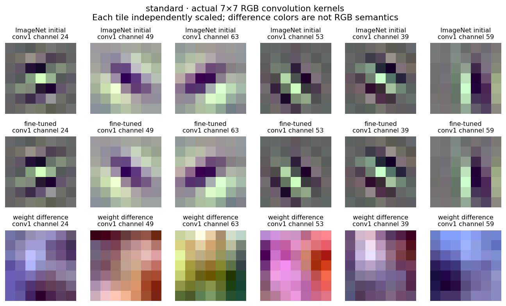
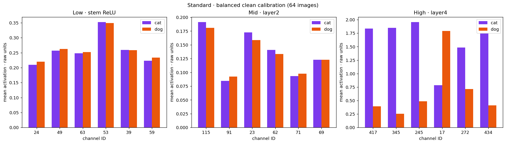
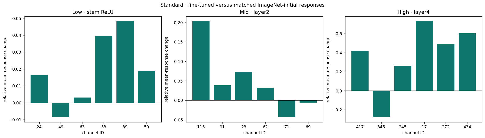
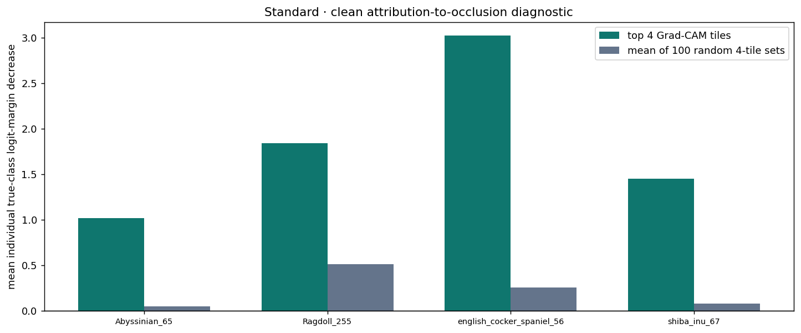
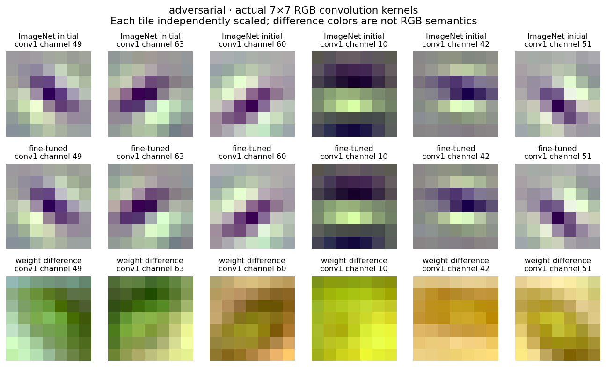
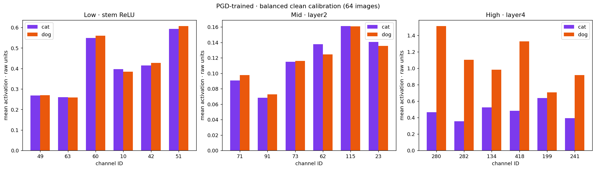
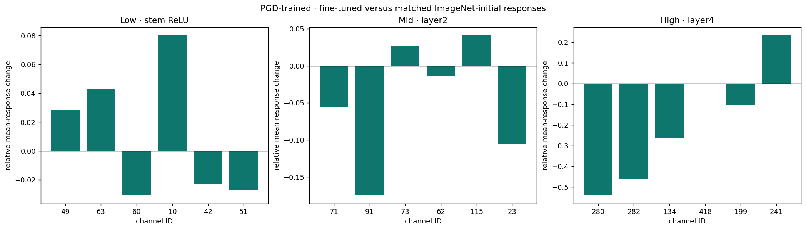
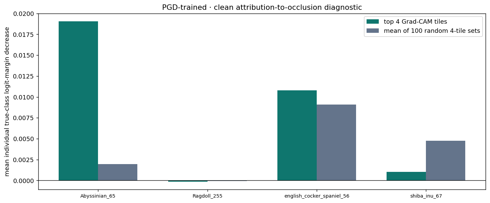
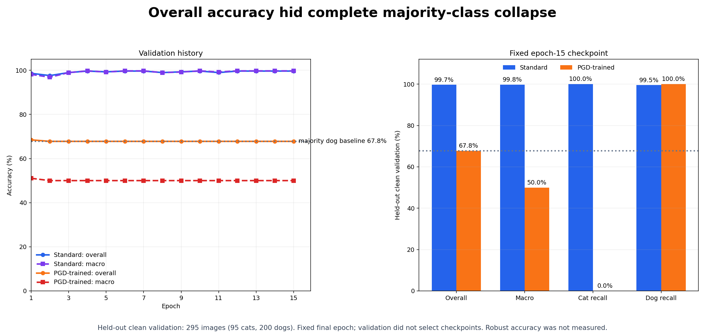
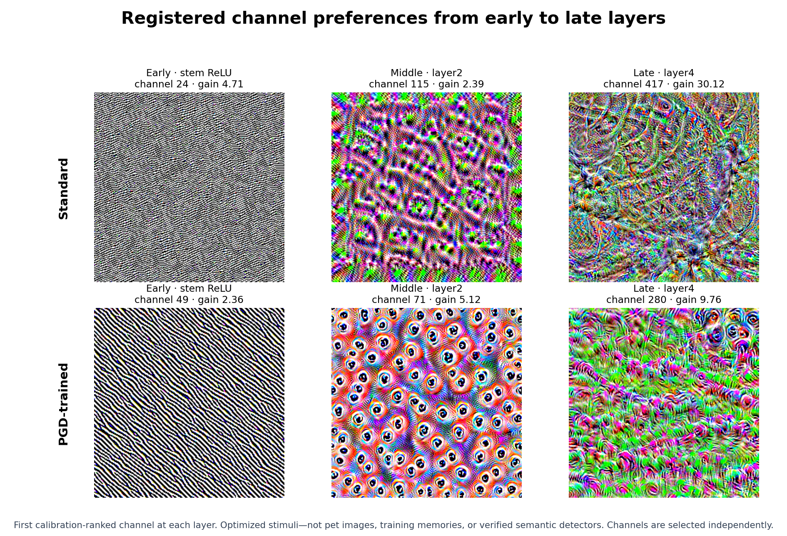

# Cat/dog CNN — current feature walkthrough

Complete current clean-input feature evidence for both standard and PGD-trained models.
Configured training length: 15 epochs. No full-test accuracy,
attack accuracy, confidence policy or risk evaluation is claimed. The four fixed anchors
are descriptive examples, not a population experiment.

## Training outcome

The fixed epoch-15 standard checkpoint reached
**99.66%** clean validation accuracy and
**99.75%** macro accuracy. The pure-PGD checkpoint reached
**67.80%** overall accuracy, but only
**50.00%** macro accuracy: it predicted every validation
image as dog, giving **0% cat recall** and **100% dog recall**. Its overall number equals the
dog-majority baseline. This is a failed classifier comparison, not evidence that PGD training
or adversarial training generally fails. Robust accuracy was not measured in this workflow.

Figure caption: Actual first-layer weights, initialized weights, and their differences. Deeper channel filters have many input channels and are instead probed with optimization and real examples.

Figure caption: Mean selected-channel responses to balanced clean calibration cats and dogs. Channels were selected on this same calibration reference, so this is descriptive, not held-out evidence of semantic specialization.

Figure caption: Relative mean-response changes against the matched ImageNet initialization on identical calibration inputs. Near-zero initial means can enlarge ratios; this is not a learning-from-scratch comparison.

Figure caption: Average single-tile occlusion effects in Grad-CAM-ranked versus random equal-area tiles. These are not jointly masked or additive effects; four anchors do not support a population claim.

Figure caption: Actual first-layer weights, initialized weights, and their differences. Deeper channel filters have many input channels and are instead probed with optimization and real examples.

Figure caption: Mean selected-channel responses to balanced clean calibration cats and dogs. Channels were selected on this same calibration reference, so this is descriptive, not held-out evidence of semantic specialization.

Figure caption: Relative mean-response changes against the matched ImageNet initialization on identical calibration inputs. Near-zero initial means can enlarge ratios; this is not a learning-from-scratch comparison.

Figure caption: Average single-tile occlusion effects in Grad-CAM-ranked versus random equal-area tiles. These are not jointly masked or additive effects; four anchors do not support a population claim.

Figure caption: Matched epoch-15 training. The pure-PGD arm's 67.8% overall validation accuracy equals the dog-majority baseline, while macro accuracy is 50% and cat recall is 0%. This is a failed classifier comparison, not a robustness result.

Figure caption: Deterministic calibration-ranked early, middle and late channel probes for both models. These optimized inputs show response preference, not anatomy or robustness.

## Synthetic optimization outcomes

- adversarial · network.layer2 channel 73: unsuccessful_zero_response_single_start; not evidence of a dead channel.
- adversarial · network.layer4 channel 418: unsuccessful_zero_response_single_start; not evidence of a dead channel.
- adversarial · network.layer4 channel 199: unsuccessful_zero_response_single_start; not evidence of a dead channel.
- adversarial · network.layer4 channel 241: unsuccessful_zero_response_single_start; not evidence of a dead channel.

## Local photo evidence

The full-stage walkthrough, real patches, activation overlays, Grad-CAM and occlusion
images remain ignored local artifacts, in the owner-generated read-only feature notebook.
Only kernel, synthetic-stimulus and aggregate figures appear above.

## Limitations

- One ImageNet-initialized ResNet-18 pair and one split/seed family limit scope.
- Synthetic stimuli are optimized inputs, not recovered training photographs.
- Channel responses do not prove anatomical concepts or causal training-source attribution.
- Receptive-field boxes are theoretical support, not exact contributing pixels.
- Grad-CAM, occlusion and randomized-weight controls are descriptive diagnostics.
- Four fixed anchors are not a population accuracy or robustness evaluation.
- PGD is a training objective here; no attack accuracy, calibration or safe-use claim is made.
- Responses do not identify which training photograph caused a filter to be learned.
- Synthetic patterns are regularized optimized stimuli, not reconstructed pet photographs.
- ImageNet pretraining already supplies feature detectors; changes from initialization are reported.
- No channel is claimed to be a verified eye, ear, fur, or other named semantic detector.
- Grad-CAM is coarse class attribution; channel sensitivity is a local input gradient.
- Theoretical high-layer receptive fields exceed the crop; an activation cell is not a tiny isolated part.
- Occlusion introduces an artificial shift; four fixed anchors support descriptive, not population, conclusions.
- Channels are ranked independently within each arm; equal channel IDs do not guarantee equal semantics.
- One matched model pair is interpreted on clean inputs; this walkthrough does not measure robust accuracy or establish physical robustness or safety.

[Machine-readable feature summary](results.json), [protocol](PROTOCOL.md),
[guided notebook](../notebooks/cat_dog_cnn_features.ipynb).
