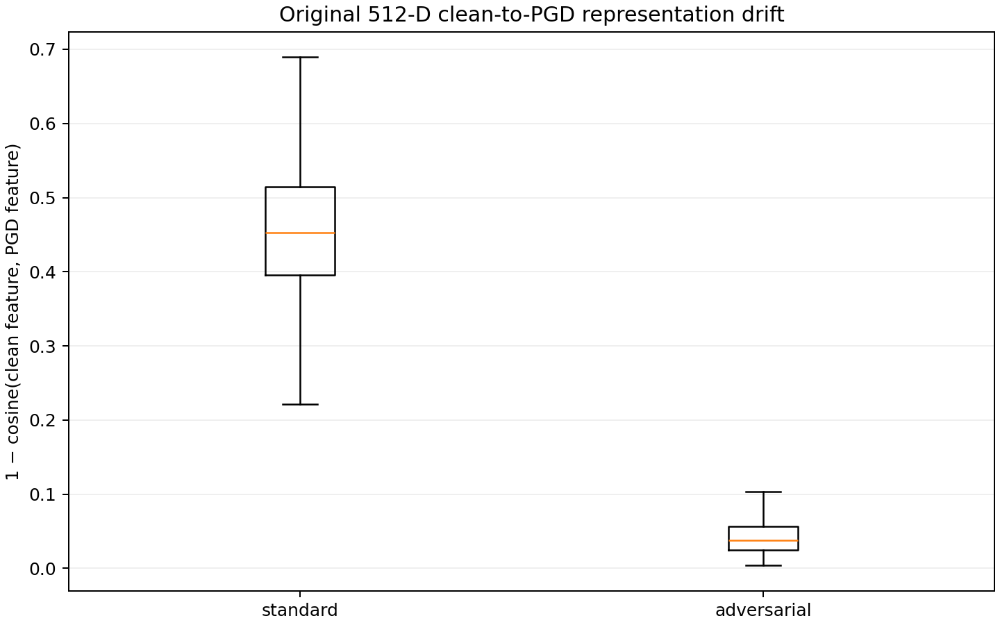
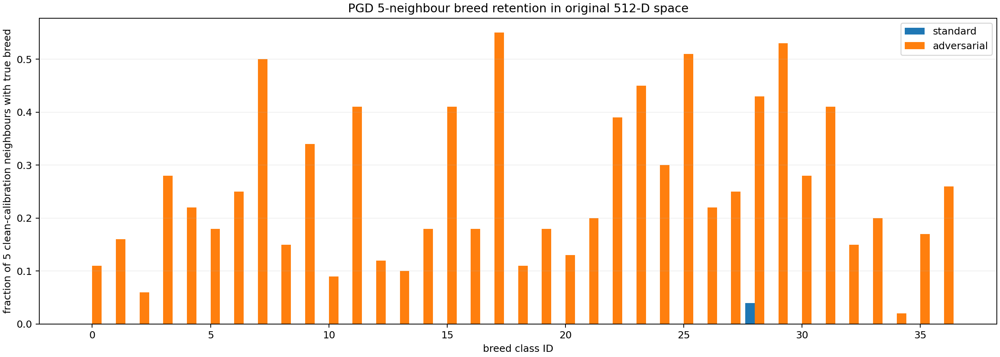

# Results: adversarial representation drift

One matched pair of ImageNet-initialized ResNet-18 models on Oxford-IIIT Pet, trained
for 15 epochs in float32 with PyTorch MPS. The standard arm used clean examples;
the comparison arm used five-step `L∞` PGD examples at `epsilon=4/255`.



## Registered result

The primary conjunction **passed**.
PGD-5 training produced both lower median clean-to-PGD cosine drift and higher
five-nearest-neighbour breed retention in the original 512-dimensional features.

| Metric | Standard | PGD-trained |
|---|---:|---:|
| Clean accuracy, full official test | 89.15% | 72.91% |
| FGSM robust accuracy, 740-image subset | 2.84% | 31.08% |
| PGD-20×5 robust accuracy, 740-image subset | 0.00% | 20.68% |
| Attack success among clean-correct samples | 100.00% | 71.51% |
| Median cosine feature drift | 0.4531 | 0.0378 |
| Median relative-L2 feature drift | 2.8832 | 0.2833 |
| PGD five-NN breed retention | 0.11% | 25.62% |
| PGD five-NN accuracy | 0.00% | 27.57% |
| Clean-to-PGD linear CKA | 0.1669 | 0.8627 |

The adversarial-minus-standard drift difference was
`-0.415384`, with a class-stratified
95% bootstrap interval of `[-0.423403, -0.408943]`.
The neighbour-retention difference was
`25.51` percentage points,
interval `[23.54, 27.62]`.
These intervals measure paired sample uncertainty, not variation from retraining.



## Corruptions and clean-fitted confidence policies

| Full-test condition | Standard accuracy | PGD-trained accuracy |
|---|---:|---:|
| `brightness-0.6` | 87.65% | 49.28% |
| `brightness-0.8` | 88.96% | 67.57% |
| `contrast-0.5` | 84.08% | 25.76% |
| `contrast-0.75` | 88.66% | 63.59% |
| `gaussian_blur-0.75` | 85.39% | 69.01% |
| `gaussian_blur-1.5` | 71.38% | 57.51% |
| `gaussian_noise-0.02` | 88.47% | 72.88% |
| `gaussian_noise-0.05` | 81.22% | 72.44% |

The standard model had higher absolute accuracy on every registered corruption. On clean
test data, its 90%-target confidence policy realized
89.23% coverage at
6.11% selective risk. The PGD-trained
policy realized 90.71% coverage at
22.51% risk. Registered shifts moved
at least one clean-fitted operating point outside its allowed coverage/risk tolerance for
both arms. Confidence is not treated as an out-of-distribution detector.

## Interpretation

Under this protocol, adversarial fine-tuning preserved much more local and global feature
structure and improved finite-attack robust accuracy, while reducing clean and corruption
accuracy. Representation retention and classifier correctness were related but not
equivalent. PCA, t-SNE, UMAP, and the difficult-pair boundary slices in the
[visual results notebook](../notebooks/oxford_pets_results_explained.ipynb) explain the
geometry; the registered decision comes from the original 512-dimensional measurements.

## Limitations

- One ImageNet-initialized ResNet-18 pair and one split/seed family were evaluated.
- Bootstrap intervals quantify paired test-sample uncertainty, not retraining variability.
- PGD-20 with five restarts is finite digital attack search, not certified robustness.
- PCA, t-SNE, and UMAP distort different relationships and are explanatory only.
- Synthetic corruptions and bounded pixel attacks do not establish physical or safe use.

## Evidence and reproduction

[results.json](results.json) contains the reviewed aggregate values and hashes. Raw
photographs, checkpoints, logits, features, and per-sample arrays remain local. The
[configuration](../configs/experiment.yaml), [protocol](PROTOCOL.md),
[implementation](../src/), [output-free guided notebook](../notebooks/oxford_pets_adversarial_representations.ipynb),
[technical report](../reports/technical_report.md), and
[long-form interpretation](../reports/long_form_report.md) are included. A fresh run uses:

```bash
.venv/bin/python src/cli.py reproduce --config configs/experiment.yaml --device mps
```

This command performs the full experiment. Reading this page or the visual results
notebook performs no training, inference, attack, or download.
